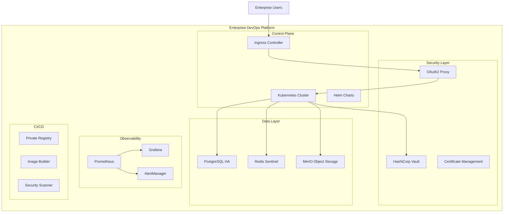
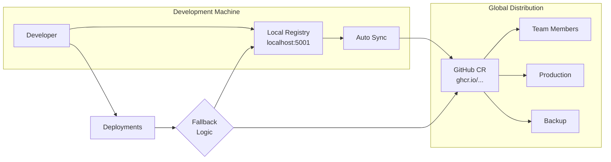

# TC Enterprise DevOps Platform™

> **Production-ready DevOps infrastructure automation for enterprise organizations**

[](https://opensource.org/licenses/MIT)
[](https://github.com/temitayocharles/tc-enterprise-devops-platform)
[](https://github.com/temitayocharles/tc-enterprise-devops-platform)
[](https://github.com/temitayocharles/tc-enterprise-devops-platform)

## 🚀 Overview

The **TC Enterprise DevOps Platform™** is a comprehensive, production-ready infrastructure automation solution designed for medium to large-scale organizations. It provides zero-touch deployment of enterprise-grade DevOps stacks with intelligent system adaptation, security hardening, and monitoring capabilities.

### 🎯 Key Features

- **🏗️ Zero-Touch Deployment** - Complete infrastructure automation with intelligent configuration
- **📊 Dynamic Resource Allocation** - Automatically adapts to your hardware specifications
- **🔒 Security-First Design** - Enterprise-grade security with secret management and audit trails
- **📈 Production Monitoring** - Full observability stack with metrics, logs, and alerting
- **🔄 High Availability** - Built-in failover, backup, and disaster recovery capabilities
- **🌐 Multi-Platform Support** - Works on Linux, macOS, and Windows (WSL2)
- **📦 Dual Registry Architecture** - Fast local registry + global GHCR for optimal performance
- **🛡️ Compliance Ready** - Audit logging and security scanning built-in
- **🔄 Cross-Machine Sharing** - Share images seamlessly between devices

## 🏢 Enterprise Solutions

### Deployment Profiles

The platform automatically selects the optimal configuration based on your infrastructure:

| Profile | Memory | CPU Cores | Use Case |
|---------|--------|-----------|----------|
| **Enterprise** | 32GB+ | 8+ cores | Large-scale production environments |
| **Professional** | 16GB+ | 4+ cores | Medium-scale development and staging |
| **Standard** | 8GB+ | 4+ cores | Small to medium teams |
| **Minimal** | 4GB+ | 2+ cores | Development and testing |

### Included Enterprise Services

- **🔐 HashiCorp Vault** - Secrets management and encryption
- **📊 Prometheus + Grafana** - Monitoring and alerting
- **💾 PostgreSQL** - Production database with backup
- **🗄️ MinIO** - S3-compatible object storage
- **🔄 Redis Sentinel** - High-availability caching
- **🌐 OAuth2 Proxy** - Enterprise authentication
- **📦 Dual Container Registry** - Local registry (fast) + GHCR (global sharing)
- **🎯 Ingress Controller** - Load balancing and SSL termination

## 🚀 Quick Start

### Prerequisites

- **Operating System**: Linux (Ubuntu 20.04+, RHEL 8+, CentOS 8+), macOS (11+), or Windows with WSL2
- **Memory**: Minimum 4GB RAM (8GB+ recommended)
- **CPU**: Minimum 2 cores (4+ recommended)
- **Storage**: 20GB available disk space
- **Network**: Internet connectivity for downloads

### One-Line Installation

```bash
curl -fsSL https://raw.githubusercontent.com/temitayocharles/tc-enterprise-devops-platform/main/install.sh | bash
```

### Manual Installation

```bash
# Clone the repository
git clone https://github.com/temitayocharles/tc-enterprise-devops-platform.git
cd tc-enterprise-devops-platform

# Make executable
chmod +x enterprise-lab-orchestrator.sh

# Run deployment
./enterprise-lab-orchestrator.sh
```

### Post-Installation: Enable Dual Registry (Recommended)

```bash
# Option 1: Interactive setup (recommended)
./setup-dual-registry.sh

# Option 2: Manual setup
export GITHUB_TOKEN=your_github_token_here
./enable-dual-registry.sh
./tc-full-pipeline.sh
```

### Advanced Options

```bash
# Force clean installation
./enterprise-lab-orchestrator.sh --force-reinstall

# Skip validation (faster deployment)
./enterprise-lab-orchestrator.sh --skip-validation

# Auto-confirm all prompts
./enterprise-lab-orchestrator.sh --auto-confirm

# Preview deployment without changes
./enterprise-lab-orchestrator.sh --dry-run

# Enable debug output
./enterprise-lab-orchestrator.sh --debug
```

## 🏗️ Architecture



## 📦 Dual Registry Architecture

The platform features an innovative dual registry system that combines the best of both worlds:

### Registry Types

**🏠 Local Registry (Primary)**
- **Location**: `localhost:5001`
- **Purpose**: Fast development and local deployments
- **Performance**: Sub-second image pulls
- **Resource Usage**: Minimal (< 100MB RAM, < 1% CPU)
- **Availability**: Always available (works offline)

**🌍 GitHub Container Registry (Secondary)**
- **Location**: `ghcr.io/temitayocharles/tc-enterprise-devops-platform`
- **Purpose**: Global sharing and backup
- **Performance**: CDN-accelerated worldwide pulls
- **Storage**: Unlimited (free for public repos)
- **Availability**: Internet-dependent

### Smart Synchronization



### Usage Patterns

**Development Workflow:**
```bash
# Fast local development
image: localhost:5001/tc-enterprise-devops-platform/my-app:dev
```

**Production Deployment:**
```bash
# Reliable global distribution
image: ghcr.io/temitayocharles/tc-enterprise-devops-platform/my-app:v1.0
```

**Cross-Machine Sharing:**
```bash
# Share images between your Mac Mini and MacBook
./tc-full-pipeline.sh  # Pushes to both registries
```

### Benefits

- ✅ **Optimal Performance** - Fast local pulls for development
- ✅ **Global Accessibility** - Share images worldwide
- ✅ **Resource Efficient** - Minimal local resource usage
- ✅ **Always Available** - Works offline with local registry
- ✅ **Automatic Fallback** - Seamless switching between registries
- ✅ **Cross-Platform** - Share between macOS devices effortlessly

## 📋 Management

### Platform Management

```bash
# Check platform status
./scripts/comprehensive-validation.sh

# Dual Registry Management
./enable-dual-registry.sh                    # Set up dual registry authentication
./tc-full-pipeline.sh                        # Push images to both registries
./scripts/check-registry-status.sh           # Check both registry statuses
./scripts/check-sync-status.sh              # Verify synchronization status

# Individual Registry Management
./scripts/tc-registry-manager.sh status     # Local registry status
./scripts/tc-registry-manager.sh list-images # List local images

# View monitoring
kubectl port-forward svc/grafana 3000:3000
# Access: http://localhost:3000

# Access Vault UI
kubectl port-forward svc/vault 8200:8200
# Access: https://localhost:8200
```

### Backup and Restore

```bash
# Create backup
./scripts/migrate.sh export backup-$(date +%Y%m%d)

# Restore from backup
./scripts/migrate.sh import backup-20250101

# List available backups
./scripts/migrate.sh list
```

### Security Operations

```bash
# Run security audit
./scripts/security-audit.sh

# Rotate secrets
./scripts/rotate-secrets.sh

# Update certificates
./scripts/update-certificates.sh
```

## 🔒 Security

### Built-in Security Features

- **🔐 Secret Management** - All secrets stored in HashiCorp Vault
- **🛡️ Network Policies** - Kubernetes network segmentation
- **📜 RBAC** - Role-based access control
- **🔍 Security Scanning** - Container vulnerability assessment
- **📊 Audit Logging** - Complete activity tracking
- **🔒 Encryption** - Data encryption at rest and in transit

### Compliance

- **SOC 2 Type II** compatible logging and access controls
- **GDPR** compliant data handling and retention
- **HIPAA** ready security configurations
- **PCI DSS** compatible network security

## 📊 Monitoring & Observability

### Pre-configured Dashboards

- **Infrastructure Overview** - Resource utilization and health
- **Application Performance** - Service metrics and SLAs
- **Security Dashboard** - Security events and compliance status
- **Cost Management** - Resource costs and optimization opportunities

### Alerting

- **System Health** - CPU, memory, disk, and network alerts
- **Application Errors** - Error rate and latency thresholds
- **Security Events** - Unauthorized access and anomaly detection
- **Business Metrics** - Custom KPI monitoring

## 🛠️ Customization

### Configuration Files

- `config.env` - Main platform configuration
- `config.local` - Environment-specific overrides
- `templates/` - Customizable deployment templates

### Custom Services

```bash
# Add custom Helm chart
helm repo add myrepo https://charts.example.com
./scripts/deploy-custom-service.sh myrepo/myservice

# Deploy custom applications
kubectl apply -f custom-manifests/
```

## 🤝 Enterprise Support

### Professional Services

- **Implementation Consulting** - Expert deployment and configuration
- **Custom Development** - Tailored solutions for your organization
- **Training Programs** - DevOps best practices and platform training
- **24/7 Support** - Production support and incident response

### Contact

- **Sales**: sales@temitayocharles.online
- **Support**: support@temitayocharles.online
- **Professional Services**: consulting@temitayocharles.online

## 📚 Documentation

- [**Installation Guide**](docs/setup/INSTALLATION.md) - Detailed installation instructions
- [**Architecture Guide**](docs/architecture/OVERVIEW.md) - Technical architecture deep-dive
- [**User Manual**](docs/guides/USER_MANUAL.md) - Day-to-day operations
- [**API Reference**](docs/api/README.md) - REST API documentation
- [**Troubleshooting**](docs/troubleshooting/README.md) - Common issues and solutions

## 🔄 Updates & Roadmap

### Current Version: 2.0.0

- ✅ Zero-touch deployment automation
- ✅ Multi-platform support (Linux, macOS, Windows)
- ✅ Enterprise security hardening
- ✅ Production monitoring stack
- ✅ Backup and disaster recovery

### Upcoming Features

- 🔜 **Multi-cloud deployment** (AWS, Azure, GCP)
- 🔜 **GitOps integration** with ArgoCD
- 🔜 **Service mesh** with Istio
- 🔜 **AI/ML platform** integration
- 🔜 **Cost optimization** recommendations

## 📄 License

This project is licensed under the MIT License - see the [LICENSE](LICENSE) file for details.

## 🌟 Contributing

We welcome contributions from the enterprise community! Please see our [Contributing Guidelines](CONTRIBUTING.md) for details.

---

**© 2025 Temitayo Charles. All Rights Reserved.**

*TC Enterprise DevOps Platform™ is a trademark of Temitayo Charles.*
