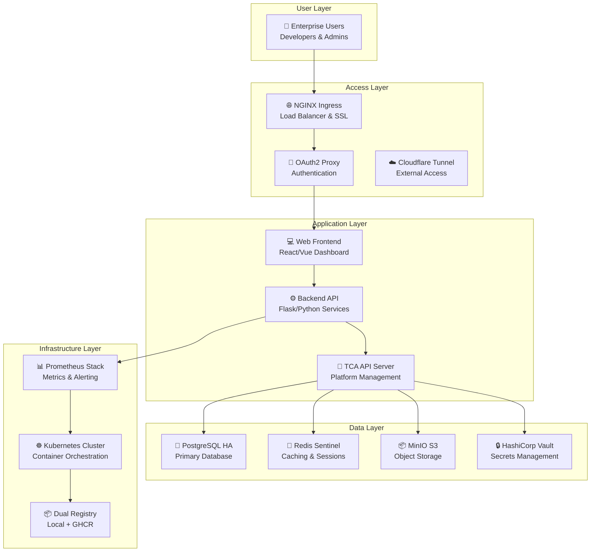
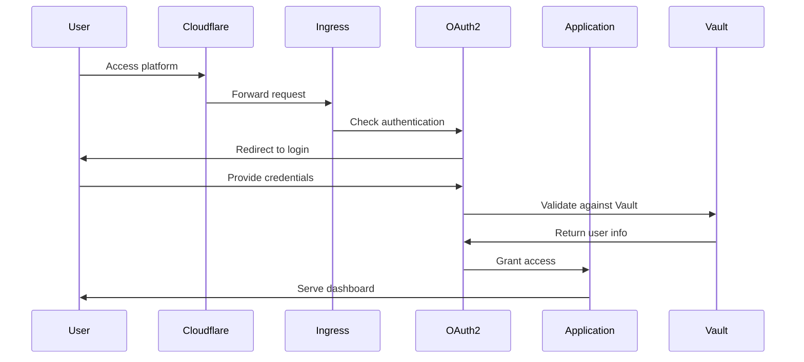
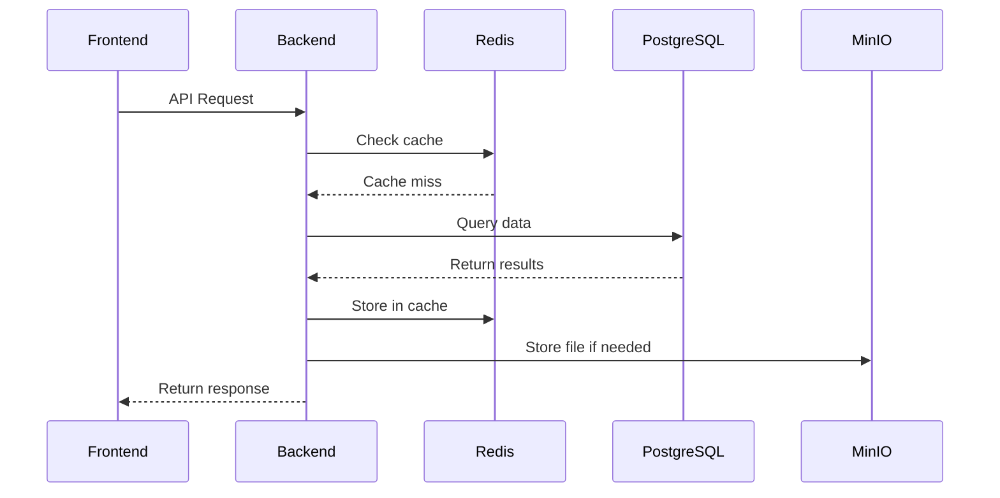
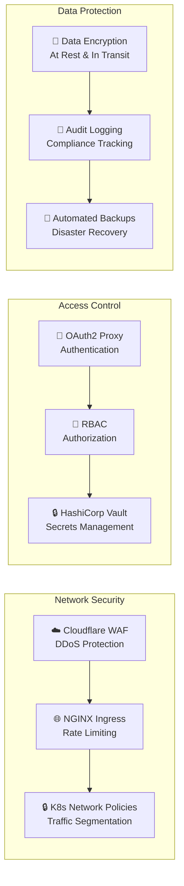
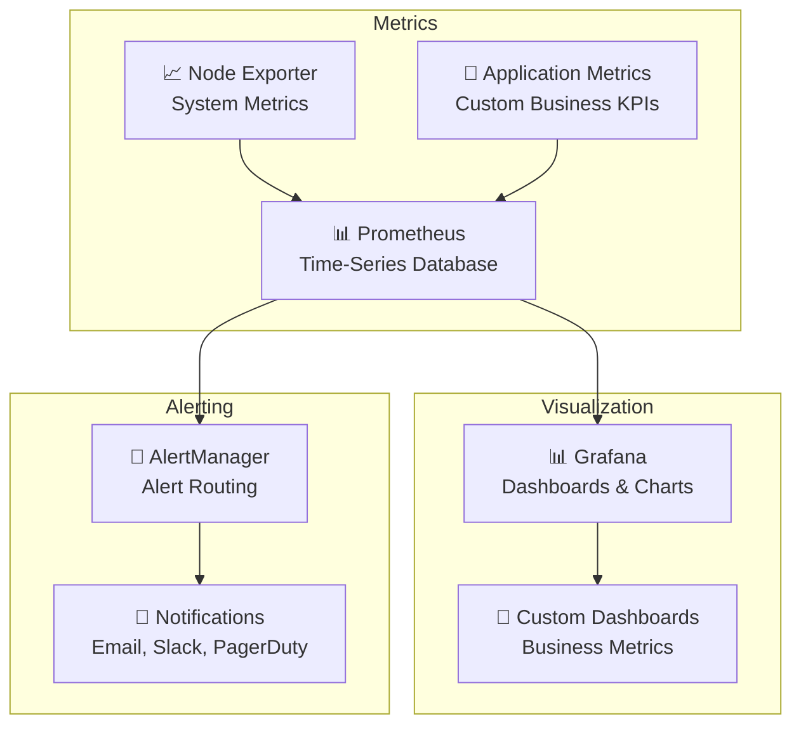
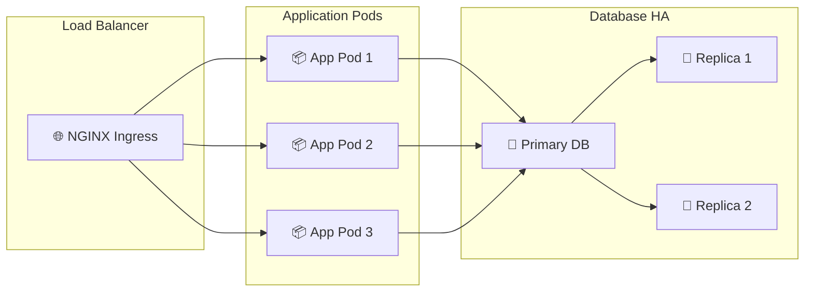
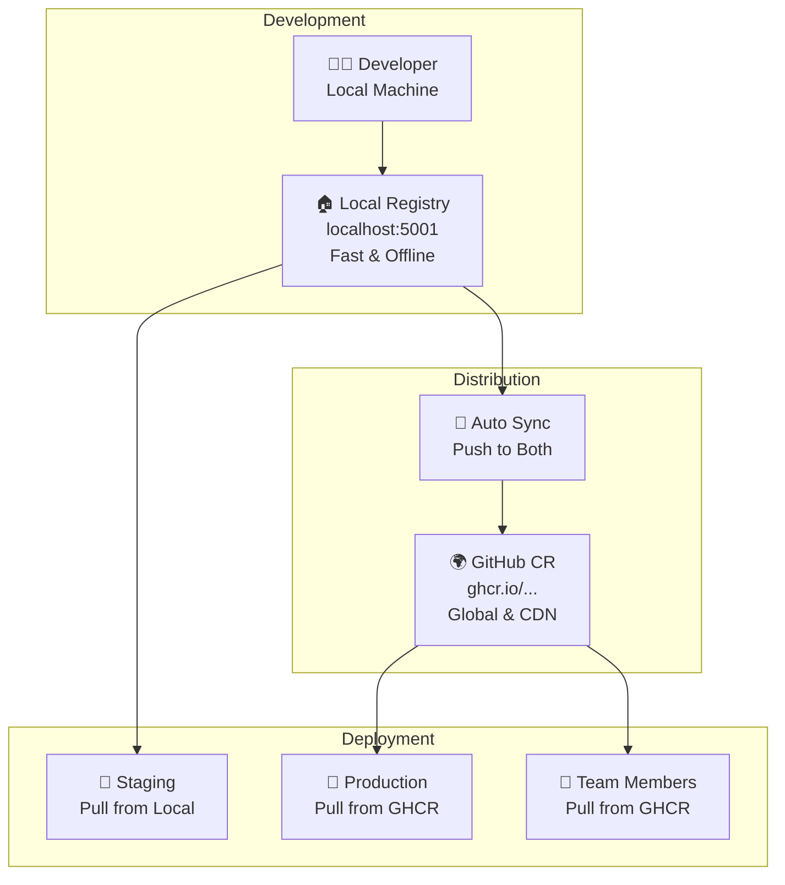
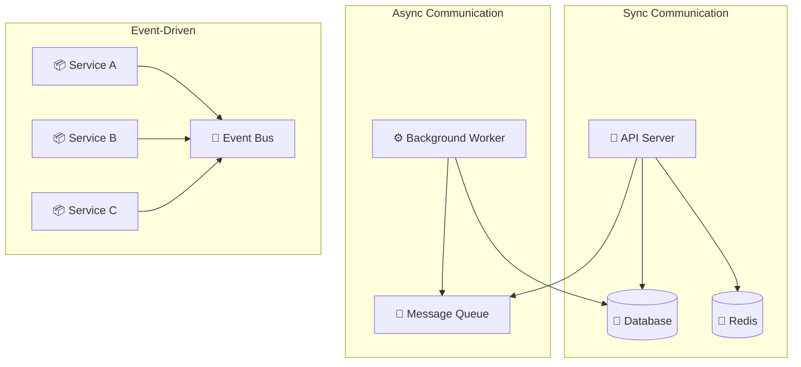
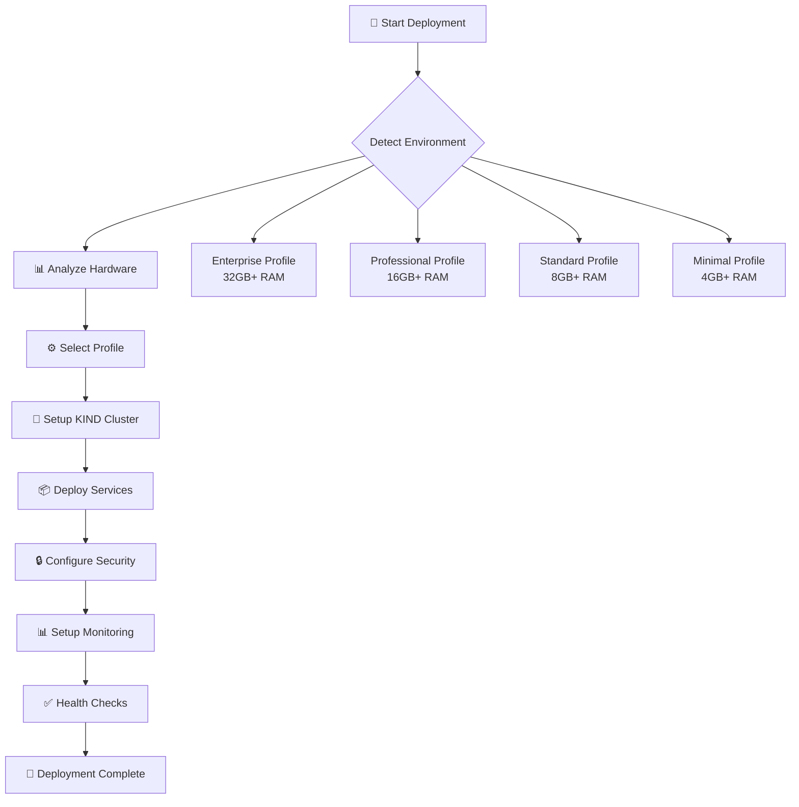

# 🏗️ Chapter 2: Architecture Overview

## 🎯 Learning Objectives
By the end of this chapter, you'll understand:
- How TCA InfraForge components work together
- The platform's layered architecture design
- Data flow patterns and security boundaries
- Scaling and high-availability patterns

**⏱️ Time to Complete:** 15-20 minutes  
**💡 Difficulty:** Beginner to Intermediate  
**🎯 Prerequisites:** Basic understanding of containers and Kubernetes

---

## 🗺️ Platform Architecture at a Glance

TCA InfraForge is built on a **layered, microservices architecture** that combines the best of cloud-native patterns with enterprise-grade reliability. Think of it as a well-orchestrated symphony where each component plays its part perfectly.



---

## 🏢 Architecture Layers Explained

### 1️⃣ **User Layer** - Your Gateway to the Platform
**What it does:** Provides secure, authenticated access to all platform features
- **👥 Enterprise Users:** Developers, administrators, and end-users
- **🔐 Authentication:** OAuth2 integration with enterprise identity providers
- **🌐 External Access:** Cloudflare tunnels for secure remote access

**Real-world analogy:** Think of this as the front door and security checkpoint of a corporate headquarters.

### 2️⃣ **Access Layer** - Traffic Control & Security
**What it does:** Manages incoming traffic, authentication, and secure connections
- **🌐 NGINX Ingress:** Routes traffic to the right services
- **🔐 OAuth2 Proxy:** Handles user authentication and authorization
- **☁️ Cloudflare Tunnel:** Provides secure external access without exposing ports

**Key benefits:**
- ✅ Single entry point for all services
- ✅ SSL termination and certificate management
- ✅ Rate limiting and DDoS protection

### 3️⃣ **Application Layer** - Your Business Logic
**What it does:** Runs your applications and provides the platform's core functionality
- **💻 Web Frontend:** User interface for platform management
- **⚙️ Backend Services:** Business logic and API endpoints
- **🔌 TCA API Server:** Platform management and automation

**Architecture pattern:** Microservices with clear separation of concerns

### 4️⃣ **Data Layer** - Information Storage & Management
**What it does:** Stores, caches, and manages all platform data
- **💾 PostgreSQL HA:** Primary database with high availability
- **🚀 Redis Sentinel:** High-performance caching and session storage
- **📦 MinIO S3:** Object storage for files and backups
- **🔒 HashiCorp Vault:** Secure secrets management

**Data flow pattern:**
```
User Request → API → Cache Check → Database Query → Response
                     ↓
              Secrets Retrieval ← Vault
```

### 5️⃣ **Infrastructure Layer** - The Foundation
**What it does:** Provides the underlying platform that everything runs on
- **☸️ Kubernetes:** Container orchestration and scheduling
- **📦 Dual Registry:** Local + GitHub Container Registry
- **📊 Monitoring Stack:** Prometheus, Grafana, and AlertManager

---

## 🔄 Data Flow Patterns

### User Authentication Flow


### Application Data Flow


---

## 🛡️ Security Architecture

### Defense in Depth Strategy
TCA InfraForge implements multiple security layers:



### Key Security Features
- **🔐 Zero-Trust Architecture:** Every request is authenticated and authorized
- **📜 Complete Audit Trail:** All actions are logged for compliance
- **🔒 Secrets Management:** Sensitive data stored securely in Vault
- **🛡️ Network Segmentation:** Services isolated with Kubernetes network policies

---

## 📊 Monitoring & Observability

### Three-Pillar Observability


### What Gets Monitored
- **🏗️ Infrastructure:** CPU, memory, disk, network usage
- **⚙️ Applications:** Response times, error rates, throughput
- **🔒 Security:** Failed login attempts, suspicious activity
- **💰 Business:** Custom KPIs and performance indicators

---

## 🚀 Scaling & High Availability

### Horizontal Scaling Pattern


### Scaling Strategies
- **📈 Horizontal Pod Autoscaling:** Automatically scale based on CPU/memory usage
- **💾 Database Replication:** PostgreSQL with automatic failover
- **🚀 Redis Clustering:** High-availability caching layer
- **☁️ Multi-zone Deployment:** Distribute across availability zones

---

## 📦 Dual Registry Architecture

### Smart Image Management


### Registry Benefits
- **⚡ Performance:** Sub-second pulls for local development
- **🌐 Global Access:** Share images worldwide via GHCR
- **💾 Offline Capable:** Works without internet connection
- **🔄 Automatic Sync:** Push once, available everywhere
- **🛡️ Backup:** Redundant storage across registries

---

## 🔧 Component Integration Patterns

### Service Communication


### Integration Benefits
- **🔄 Loose Coupling:** Services can be updated independently
- **📈 Scalability:** Components scale based on their specific needs
- **🛡️ Resilience:** Failure in one service doesn't break others
- **🔧 Maintainability:** Clear boundaries between components

---

## 🎯 Architecture Decision Records

### Why Kubernetes?
- **🏗️ Declarative Configuration:** Define desired state, Kubernetes makes it happen
- **📈 Auto-Scaling:** Automatically adjust resources based on demand
- **🛡️ Self-Healing:** Automatically restart failed containers
- **🌐 Service Discovery:** Automatic service registration and discovery

### Why Dual Registry?
- **⚡ Development Speed:** Local registry provides instant access
- **🌍 Global Distribution:** GHCR ensures worldwide availability
- **💰 Cost Effective:** Free public repos with unlimited storage
- **🔄 Seamless Workflow:** Single push, multiple deployment options

### Why Microservices?
- **🔧 Independent Deployment:** Update services without affecting others
- **📊 Technology Diversity:** Use the best tool for each job
- **👥 Team Autonomy:** Teams can work on services independently
- **📈 Scalability:** Scale individual components as needed

---

## 🚀 Deployment Architecture

### Zero-Touch Deployment Flow


### Profile-Based Deployment
- **🏢 Enterprise:** Full production stack with high availability
- **💼 Professional:** Medium-scale with essential services
- **📊 Standard:** Small team setup with core functionality
- **🧪 Minimal:** Development and testing environment

---

## 📋 Summary

TCA InfraForge's architecture is designed for **enterprise-scale reliability** while maintaining **developer-friendly simplicity**. The layered approach ensures:

- **🔒 Security:** Defense in depth with multiple protection layers
- **📈 Scalability:** Horizontal scaling for growing demands
- **🛡️ Reliability:** High availability and automatic failover
- **🔧 Maintainability:** Clear separation of concerns and loose coupling
- **⚡ Performance:** Optimized for both development and production

### Key Takeaways
1. **Layered Design:** Each layer has a specific responsibility
2. **Microservices:** Independent, scalable service components
3. **Dual Registry:** Best of both local speed and global distribution
4. **Security First:** Zero-trust architecture throughout
5. **Observability:** Complete monitoring and alerting coverage

---

## 🎯 What's Next?

Now that you understand the architecture, you're ready to:

1. **[⚡ Quick Start Guide](./03-quick-start-guide.md)** - Deploy your first TCA InfraForge cluster
2. **[🔧 Automated Deployment](./04-automated-deployment.md)** - Deep dive into the deployment process
3. **[📊 Monitoring & Observability](./07-monitoring-observability.md)** - Set up comprehensive monitoring

**💡 Pro Tip:** The architecture is designed to be **infrastructure-agnostic** - it works the same whether you're running on a single MacBook or a multi-node Kubernetes cluster!

---

*Ready to see this architecture in action? Let's move to the Quick Start Guide and deploy your first TCA InfraForge cluster!* 🚀
