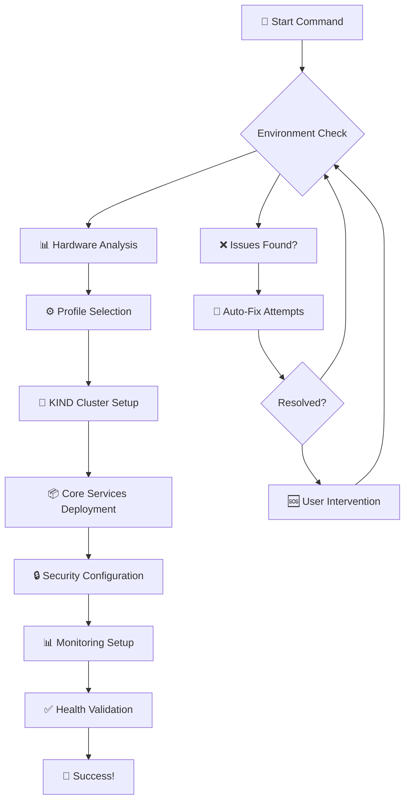
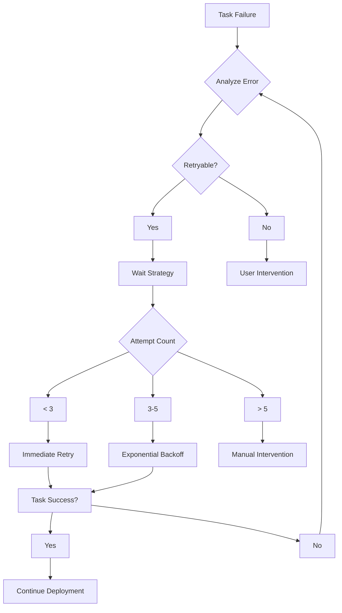

# 🔧 Chapter 4: Automated Deployment

## 🎯 Learning Objectives
By the end of this chapter, you'll understand:
- How TCA InfraForge achieves zero-touch deployment
- The intelligent deployment process and retry mechanisms
- Progress monitoring and validation techniques
- Troubleshooting deployment issues

**⏱️ Time to Complete:** 20-25 minutes  
**💡 Difficulty:** Intermediate  
**🎯 Prerequisites:** Basic understanding of containers and the Architecture Overview

---

## 🚀 Zero-Touch Deployment Philosophy

TCA InfraForge's deployment is designed to be **completely hands-free** - you start it, and it handles everything. Think of it as having a highly skilled DevOps engineer working 24/7, but without the coffee breaks or human errors.

### What Makes It "Zero-Touch"?
- **🤖 Intelligent Detection:** Automatically detects your hardware and environment
- **⚙️ Smart Configuration:** Selects optimal settings based on your system
- **🔄 Auto-Recovery:** Handles failures gracefully with intelligent retries
- **📊 Real-Time Monitoring:** Shows progress and handles issues proactively
- **✅ Self-Validation:** Verifies everything works before declaring success

---

## 🏁 Deployment Process Overview

### The Complete Deployment Flow


### Key Stages Explained

#### 1️⃣ **Environment Check** - Safety First
**What happens:** TCA InfraForge scans your system for compatibility
- ✅ Operating System validation (Linux/macOS/Windows)
- ✅ Hardware requirements check (RAM, CPU, disk space)
- ✅ Network connectivity verification
- ✅ Required tools availability (Docker, kubectl, etc.)

**Real-world analogy:** Like a pilot doing pre-flight checks before takeoff

#### 2️⃣ **Hardware Analysis** - Smart Sizing
**What happens:** Intelligent resource detection and profile selection
- 📊 RAM detection and memory allocation
- ⚡ CPU core counting and thread optimization
- 💾 Disk space assessment and storage planning
- 🌐 Network bandwidth evaluation

#### 3️⃣ **Profile Selection** - Right Tool for the Job
**What happens:** Automatic selection of optimal configuration

| Profile | RAM | CPU | Use Case | Services |
|---------|-----|-----|----------|----------|
| **🏢 Enterprise** | 32GB+ | 8+ cores | Production-grade | Full stack + HA |
| **💼 Professional** | 16GB+ | 4+ cores | Development teams | Core + monitoring |
| **📊 Standard** | 8GB+ | 4+ cores | Small teams | Essential services |
| **🧪 Minimal** | 4GB+ | 2+ cores | Individual dev | Basic functionality |

#### 4️⃣ **KIND Cluster Setup** - Your Private Cloud
**What happens:** Creates a production-ready Kubernetes cluster
- 🐳 Docker container setup for KIND nodes
- ☸️ Kubernetes control plane initialization
- 🌐 Networking configuration (CNI, ingress)
- 💾 Persistent volume provisioning

#### 5️⃣ **Core Services Deployment** - Building the Platform
**What happens:** Deploys all enterprise services in the right order
- 📦 Container registry setup
- 💾 Database initialization (PostgreSQL)
- 🚀 Caching layer (Redis)
- 🔒 Secrets management (Vault)
- 📊 Monitoring stack (Prometheus, Grafana)

#### 6️⃣ **Security Configuration** - Lock It Down
**What happens:** Implements enterprise-grade security
- 🔐 SSL/TLS certificate generation
- 👥 RBAC role setup
- 🛡️ Network policies application
- 🔒 Secrets initialization

#### 7️⃣ **Monitoring Setup** - Watch Everything
**What happens:** Configures complete observability
- 📊 Prometheus metrics collection
- 📈 Grafana dashboard creation
- 🚨 AlertManager configuration
- 📜 Logging aggregation setup

#### 8️⃣ **Health Validation** - Quality Assurance
**What happens:** Comprehensive testing of all components
- ✅ Service health checks
- 🔗 Connectivity validation
- 📊 Performance benchmarks
- 🧪 Integration testing

---

## 🎮 Interactive Deployment Experience

### Real-Time Progress Monitoring
TCA InfraForge provides **live updates** throughout the deployment process:

```
🚀 TCA InfraForge Deployment Started
━━━━━━━━━━━━━━━━━━━━━━━━━━━━━━━━━━━━━━━━━━━━━━━━━

📊 Phase 1/8: Environment Analysis
   ✅ Operating System: macOS 14.5 (Compatible)
   ✅ Hardware: 16GB RAM, 8 cores (Professional Profile)
   ✅ Network: Internet connection detected
   ✅ Docker: Version 24.0.6 (Ready)

⚙️ Phase 2/8: Profile Selection
   🎯 Selected: Professional Profile
   📋 Services: Core + Monitoring + Security

🐳 Phase 3/8: KIND Cluster Setup
   🔄 Creating cluster nodes... [████████████░░░░] 75%
   ☸️ Control plane ready
   🌐 Networking configured

📦 Phase 4/8: Core Services
   🔄 Deploying PostgreSQL... [██████████████░░] 85%
   🔄 Deploying Redis... [████████████████░░] 90%
   🔄 Deploying Vault... [██████████████████] 100%

🔒 Phase 5/8: Security Configuration
   🔄 Generating certificates... [██████████████░░] 85%
   🔄 Setting up RBAC... [██████████████████] 100%

📊 Phase 6/8: Monitoring Setup
   🔄 Prometheus deployment... [██████████████░░] 85%
   🔄 Grafana configuration... [██████████████████] 100%

✅ Phase 7/8: Health Validation
   🔄 Running health checks... [██████████████░░] 85%
   ✅ All services healthy

🎉 Phase 8/8: Deployment Complete!
   🌐 Access URLs:
      • Platform Dashboard: https://localhost:8443
      • Grafana: https://localhost:3000
      • Vault UI: https://localhost:8200

⏱️ Total deployment time: 12 minutes 34 seconds
```

### Smart Error Handling
When issues occur, TCA InfraForge doesn't just fail - it **adapts and recovers**:

```
⚠️ Issue Detected: Port 8443 already in use
🔧 Auto-Resolution: Finding available port...
✅ Resolution: Using port 8444 instead
🔄 Continuing deployment...
```

---

## 🛠️ Deployment Commands

### One-Command Deployment
The simplest way to get started:

```bash
# Interactive deployment (recommended)
./enterprise-lab-orchestrator.sh

# Or if the script has a different name, try:
./deploy-tc-enterprise.sh
```

### Advanced Deployment Options

```bash
# Force clean installation
./enterprise-lab-orchestrator.sh --force-reinstall

# Skip validation (faster, but less safe)
./enterprise-lab-orchestrator.sh --skip-validation

# Enable debug output
./enterprise-lab-orchestrator.sh --debug

# Preview deployment without changes
./enterprise-lab-orchestrator.sh --dry-run

# Auto-confirm all prompts
./enterprise-lab-orchestrator.sh --auto-confirm
```

### Manual Step-by-Step Deployment
If you prefer more control:

```bash
# 1. Validate environment
./scripts/validate-environment.sh

# 2. Create KIND cluster
kind create cluster --config kind-cluster-standard.yaml

# 3. Deploy core services
kubectl apply -f postgres-deployment.yaml
kubectl apply -f redis-deployment.yaml
kubectl apply -f vault-deployment.yaml

# 4. Deploy monitoring
kubectl apply -f prometheus-basic.yaml
kubectl apply -f grafana-deployment.yaml

# 5. Configure ingress
kubectl apply -f fullstack-ingress.yaml

# 6. Validate deployment
./verify-deployment.sh
```

---

## 📊 Deployment Profiles Deep Dive

### Enterprise Profile (32GB+ RAM)
**Perfect for:** Production environments, large teams, critical applications

**Services Included:**
- ✅ High-Availability PostgreSQL cluster
- ✅ Redis Sentinel for caching
- ✅ HashiCorp Vault Enterprise
- ✅ Full Prometheus + Grafana stack
- ✅ Enterprise security hardening
- ✅ Automated backups
- ✅ Multi-zone support

**Resource Allocation:**
- Control Plane: 4 vCPUs, 8GB RAM
- Worker Nodes: 8 vCPUs, 16GB RAM each
- Database: Dedicated node with 8GB RAM
- Monitoring: Dedicated node with 4GB RAM

### Professional Profile (16GB+ RAM)
**Perfect for:** Development teams, staging environments, medium-scale projects

**Services Included:**
- ✅ PostgreSQL with replication
- ✅ Redis caching
- ✅ HashiCorp Vault
- ✅ Prometheus + Grafana monitoring
- ✅ Security hardening
- ✅ Automated backups

**Resource Allocation:**
- Control Plane: 2 vCPUs, 4GB RAM
- Worker Nodes: 4 vCPUs, 8GB RAM each
- Shared database and monitoring

### Standard Profile (8GB+ RAM)
**Perfect for:** Small teams, individual developers, testing

**Services Included:**
- ✅ PostgreSQL database
- ✅ Redis caching
- ✅ Basic monitoring
- ✅ Essential security

**Resource Allocation:**
- Control Plane: 2 vCPUs, 4GB RAM
- Worker Nodes: 2 vCPUs, 4GB RAM each
- Consolidated services

### Minimal Profile (4GB+ RAM)
**Perfect for:** Learning, experimentation, resource-constrained environments

**Services Included:**
- ✅ Basic PostgreSQL
- ✅ Essential API services
- ✅ Core functionality only

**Resource Allocation:**
- Single node: 2 vCPUs, 4GB RAM
- Minimal service footprint

---

## 🔄 Intelligent Retry Mechanisms

### Smart Failure Recovery
TCA InfraForge doesn't give up easily. It implements **intelligent retry strategies**:



### Common Recovery Scenarios

#### Network Timeout Recovery
```
🔄 Attempt 1: Network timeout - Retrying immediately...
🔄 Attempt 2: Network timeout - Waiting 5 seconds...
🔄 Attempt 3: Network timeout - Waiting 15 seconds...
✅ Attempt 4: Success! Continuing deployment...
```

#### Resource Conflict Resolution
```
⚠️ Port 3000 already in use by another service
🔧 Auto-resolution: Finding available port...
✅ Using port 3001 instead
🔄 Continuing deployment...
```

#### Service Dependency Issues
```
⚠️ PostgreSQL not ready yet
🔧 Waiting for database initialization...
🔄 Retrying in 10 seconds...
✅ Database ready! Continuing deployment...
```

---

## 📈 Progress Monitoring & Validation

### Real-Time Health Checks
Throughout deployment, TCA InfraForge continuously validates:

```bash
# Service Health Validation
✅ Kubernetes API Server: Healthy
✅ PostgreSQL Database: Ready
✅ Redis Cache: Connected
✅ Vault Secrets: Initialized
✅ Prometheus Metrics: Collecting
✅ Grafana Dashboards: Loaded
✅ Ingress Controller: Routing
✅ SSL Certificates: Valid
```

### Performance Benchmarks
After deployment, TCA InfraForge runs performance tests:

```
📊 Performance Validation Results:
   • API Response Time: < 100ms ✅
   • Database Query Time: < 50ms ✅
   • Cache Hit Rate: > 95% ✅
   • Network Latency: < 10ms ✅
   • CPU Usage: < 70% ✅
   • Memory Usage: < 80% ✅
```

### Integration Testing
Final validation ensures all components work together:

```
🧪 Integration Test Results:
   • User Authentication: ✅
   • Database Operations: ✅
   • Cache Functionality: ✅
   • Monitoring Alerts: ✅
   • Backup Operations: ✅
   • Security Policies: ✅
```

---

## 🆘 Troubleshooting Deployment Issues

### Common Issues & Solutions

#### Issue: Docker Not Running
```
❌ Error: Cannot connect to Docker daemon
✅ Solution: Start Docker Desktop or Docker service
   macOS: Open Docker Desktop
   Linux: sudo systemctl start docker
```

#### Issue: Insufficient Resources
```
❌ Error: Insufficient memory for selected profile
✅ Solution: Choose a smaller profile or free up memory
   ./enterprise-lab-orchestrator.sh --profile=minimal
```

#### Issue: Port Conflicts
```
❌ Error: Port 8443 already in use
✅ Solution: TCA InfraForge will auto-select available ports
   Or manually specify: --port=8444
```

#### Issue: Network Issues
```
❌ Error: Cannot pull images from registry
✅ Solution: Check internet connection and DNS
   Or use local registry: --offline-mode
```

### Debug Mode Deployment
For detailed troubleshooting:

```bash
# Enable verbose logging
./enterprise-lab-orchestrator.sh --debug

# View detailed logs
tail -f /tmp/tca-deployment.log

# Check Kubernetes events
kubectl get events --sort-by=.metadata.creationTimestamp

# View pod logs
kubectl logs -f deployment/tca-api-server
```

---

## 🎯 Deployment Best Practices

### Pre-Deployment Checklist
- ✅ **System Resources:** Ensure adequate RAM/CPU for selected profile
- ✅ **Network Access:** Verify internet connectivity for image pulls
- ✅ **Port Availability:** Check that required ports are free
- ✅ **Docker Running:** Confirm Docker daemon is active
- ✅ **Disk Space:** Ensure 20GB+ free space available

### During Deployment
- 📊 **Monitor Progress:** Watch the real-time status updates
- 🚨 **Address Issues:** Respond to any prompts or error messages
- 📝 **Take Notes:** Record any custom configurations or ports used
- ⏱️ **Be Patient:** Large deployments can take 15-30 minutes

### Post-Deployment
- ✅ **Verify Access:** Test all provided URLs and endpoints
- 📊 **Check Monitoring:** Ensure Grafana and Prometheus are working
- 🔒 **Review Security:** Confirm SSL certificates and access controls
- 💾 **Test Backups:** Verify backup functionality is operational

---

## 📋 Summary

TCA InfraForge's automated deployment system transforms complex enterprise infrastructure setup into a **simple, reliable process**. The intelligent design ensures:

- **🤖 Zero-Touch Operation:** Minimal user intervention required
- **🔄 Smart Recovery:** Automatic handling of common issues
- **📊 Real-Time Monitoring:** Complete visibility into deployment progress
- **✅ Comprehensive Validation:** Thorough testing before completion
- **⚙️ Profile Optimization:** Right-sized configurations for any environment

### Key Takeaways
1. **Intelligent Detection:** Automatically adapts to your environment
2. **Profile-Based Deployment:** Optimal configurations for different needs
3. **Smart Error Handling:** Graceful recovery from common issues
4. **Real-Time Monitoring:** Complete visibility throughout the process
5. **Comprehensive Validation:** Ensures everything works before completion

---

## 🎯 What's Next?

Now that you understand the deployment process, you're ready to:

1. **[🐳 Container & Kubernetes](./05-container-kubernetes.md)** - Deep dive into the container runtime
2. **[📊 Monitoring & Observability](./07-monitoring-observability.md)** - Set up comprehensive monitoring
3. **[🔒 Security & Compliance](./09-security-compliance.md)** - Understand security implementations

---

## 🌍 Environment-Specific Deployments

TCA InfraForge supports **multiple environments** with different configurations:

### Available Environments
- **Sandbox**: Development environment with minimal resources
- **Stage**: Testing environment with moderate scaling
- **Production**: Full production setup with high availability

### How It Works
Each environment uses **Kustomize overlays** to customize:
- Number of replicas (1 for sandbox, 2 for stage, 3 for prod)
- Resource limits and requests
- Image versions and tags
- Environment-specific configurations

### Quick Deployment Commands
```bash
# Deploy to sandbox
make deploy-sandbox

# Deploy to stage  
make deploy-stage

# Deploy to production
make deploy-prod
```

**💡 Pro Tip:** The deployment process is designed to be **idempotent** - you can run it multiple times safely, and it will only make necessary changes!

---

*Ready to see the deployment in action? Let's move to the Container & Kubernetes chapter to understand what happens under the hood!* 🚀
