# 📊 Chapter 7: Monitoring & Observability

## 🎯 Learning Objectives
By the end of this chapter, you'll understand:
- How TCA InfraForge provides complete observability
- Setting up and using Prometheus, Grafana, and AlertManager
- Creating custom dashboards and alerts
- Monitoring best practices for enterprise environments

**⏱️ Time to Complete:** 25-30 minutes  
**💡 Difficulty:** Intermediate  
**🎯 Prerequisites:** Basic understanding of containers and deployment

---

## 👁️ Observability Philosophy

TCA InfraForge treats **observability as a first-class citizen**. Instead of reactive monitoring, we provide **proactive insights** that help you understand, optimize, and troubleshoot your platform before issues become problems.

### The Three Pillars of Observability
- **📊 Metrics:** Quantitative measurements of system performance
- **📝 Logs:** Detailed records of system events and activities
- **🔍 Traces:** Request flow visualization across services

**Real-world analogy:** Like having a complete dashboard in your car that shows speed, fuel level, engine health, and even predicts when maintenance is needed.

---

## 🏗️ Monitoring Stack Architecture

### Complete Observability Stack

```mermaid
graph TB
    subgraph "Data Collection"
        NODE_EXPORTER[📈 Node Exporter<br/>System Metrics]
        APP_METRICS[📱 Application Metrics<br/>Custom KPIs]
        LOG_SOURCES[📜 Log Sources<br/>Application Logs]
    end

    subgraph "Metrics Pipeline"
        PROMETHEUS[📊 Prometheus<br/>Time-Series DB<br/>Metrics Collection]
        PROMETHEUS --> ALERTMANAGER[🚨 AlertManager<br/>Alert Routing]
    end

    subgraph "Visualization"
        GRAFANA[📊 Grafana<br/>Dashboards<br/>Data Visualization]
    end

    subgraph "Log Aggregation"
        FLUENT_BIT[🔄 Fluent Bit<br/>Log Collection]
        ELASTICSEARCH[(🔍 Elasticsearch<br/>Log Storage)]
        KIBANA[📊 Kibana<br/>Log Analysis]
    end

    NODE_EXPORTER --> PROMETHEUS
    APP_METRICS --> PROMETHEUS
    LOG_SOURCES --> FLUENT_BIT
    FLUENT_BIT --> ELASTICSEARCH
    ELASTICSEARCH --> KIBANA
    PROMETHEUS --> GRAFANA
    ALERTMANAGER --> NOTIFICATIONS[📢 Notifications<br/>Email/Slack/PagerDuty]
```


### Component Roles

#### Prometheus - The Metrics Brain
- **📊 Time-Series Database:** Stores all metrics data
- **🔍 Query Language:** Powerful PromQL for data analysis
- **🚨 Alerting Engine:** Triggers alerts based on conditions
- **📈 Auto-Discovery:** Automatically finds services to monitor

#### Grafana - The Visualization Expert
- **📊 Dashboard Creation:** Beautiful, interactive visualizations
- **🔗 Data Sources:** Connects to multiple data sources
- **👥 Sharing:** Team collaboration and dashboard sharing
- **📱 Mobile Support:** Access dashboards on any device

#### AlertManager - The Notification Hub
- **📢 Routing:** Smart alert routing based on severity
- **🔇 Silencing:** Temporary alert suppression
- **👥 Grouping:** Prevents alert storms
- **🔄 Integration:** Connects to email, Slack, PagerDuty, etc.

---

## 🚀 Getting Started with Monitoring

### Accessing Your Monitoring Stack

After deployment, TCA InfraForge provides these monitoring endpoints:

```bash
# Grafana Dashboard (Main Monitoring Interface)
# URL: https://localhost:3000
# Default Credentials: admin / admin (change immediately!)

# Prometheus Metrics Database
# URL: https://localhost:9090
# Direct access to metrics and query interface

# AlertManager (Alert Management)
# URL: https://localhost:9093
# Configure alert routing and silencing
```

### First Login Setup
```bash
# 1. Open Grafana in your browser
open https://localhost:3000

# 2. Login with default credentials
Username: admin
Password: admin

# 3. Change password immediately
# 4. Explore the pre-configured dashboards
```

---

## 📊 Pre-Configured Dashboards

TCA InfraForge comes with **production-ready dashboards** covering all aspects of your platform:

### Infrastructure Overview Dashboard
**What it shows:** Complete system health at a glance
- 🖥️ **Node Resources:** CPU, memory, disk usage across all nodes
- 🌐 **Network Traffic:** Bandwidth utilization and error rates
- 📦 **Container Metrics:** Pod status, restarts, resource usage
- 💾 **Storage:** Disk I/O, space utilization, volume health

**Key Metrics:**
```
CPU Usage: Current % and trends
Memory Usage: RAM consumption patterns
Disk I/O: Read/write operations per second
Network: Bandwidth and packet rates
```

### Application Performance Dashboard
**What it shows:** How your applications are performing
- ⚡ **Response Times:** API latency and throughput
- 📈 **Request Rates:** RPS (requests per second)
- ❌ **Error Rates:** 4xx/5xx error percentages
- 👥 **Active Users:** Concurrent user counts

**Business KPIs:**
```
API Response Time: < 100ms target
Error Rate: < 1% target
Throughput: > 1000 RPS target
Availability: > 99.9% uptime
```

### Database Performance Dashboard
**What it shows:** Database health and performance
- 🔍 **Query Performance:** Slow query analysis
- 💾 **Connection Pool:** Active/idle connections
- 📊 **Storage Growth:** Database size trends
- 🔄 **Replication Status:** Master-slave synchronization

**Database Metrics:**
```
Query Response Time: < 50ms
Connection Utilization: < 80%
Storage Growth Rate: < 10GB/month
Replication Lag: < 1 second
```

### Security Monitoring Dashboard
**What it shows:** Security events and compliance status
- 🚨 **Failed Logins:** Authentication failure patterns
- 🛡️ **Firewall Events:** Blocked connection attempts
- 📜 **Audit Events:** Security-relevant activities
- 🔍 **Compliance Status:** Policy violation tracking

**Security KPIs:**
```
Failed Login Attempts: < 5/hour
Suspicious Activities: 0
Policy Violations: 0
Compliance Score: 100%
```

---

## 🎨 Creating Custom Dashboards

### Step-by-Step Dashboard Creation

#### 1. Access Grafana Dashboard Builder
```bash
# Open Grafana
open https://localhost:3000

# Navigate to: Create → Dashboard
# Click "Add new panel"
```

#### 2. Choose Your Data Source
```
Data Source: Prometheus
Query Type: PromQL (Prometheus Query Language)
```

#### 3. Build Your First Panel
**Example: CPU Usage Over Time**
```
# PromQL Query
rate(cpu_usage_percent[5m]) * 100

# Panel Settings
Title: CPU Usage %
Type: Time Series
Unit: Percent (0-100)
Thresholds: Warning > 80%, Critical > 90%
```

#### 4. Add Multiple Panels
**Common Panel Types:**
- **Time Series:** Trends over time (CPU, memory, network)
- **Gauge:** Current status (disk usage, temperature)
- **Table:** Detailed metrics (top processes, error logs)
- **Heatmap:** Frequency distribution (response times)
- **Stat:** Single value with trend (total requests)

### Advanced Dashboard Features

#### Variables for Dynamic Dashboards
```yaml
# Dashboard Variable Configuration
variable_name: "namespace"
query: "kube_namespace"
label: "Kubernetes Namespace"
multi_value: true
```

#### Template Variables Usage
```
# Query with variable
sum(rate(http_requests_total{namespace="$namespace"}[5m]))
```

#### Drill-Down Capabilities
- **Click on panels** to see detailed breakdowns
- **Time range selection** for focused analysis
- **Legend interactions** to show/hide data series

---

## 🚨 Alerting & Notification Setup

### Creating Effective Alerts

#### 1. Define Alert Conditions
**Example: High CPU Usage Alert**
```yaml
# Alert Rule Configuration
alert: HighCPUUsage
expr: cpu_usage_percent > 85
for: 5m
labels:
  severity: warning
annotations:
  summary: "High CPU usage detected"
  description: "CPU usage is above 85% for more than 5 minutes"
```

#### 2. Configure Alert Routing
```yaml
# AlertManager Configuration
route:
  group_by: ['alertname', 'severity']
  group_wait: 10s
  group_interval: 10s
  repeat_interval: 1h
  receiver: 'slack-notifications'

receivers:
- name: 'slack-notifications'
  slack_configs:
  - api_url: 'YOUR_SLACK_WEBHOOK_URL'
    channel: '#alerts'
    title: '{{ .GroupLabels.alertname }}'
    text: '{{ .CommonAnnotations.description }}'
```

#### 3. Set Up Notification Channels

**Email Notifications:**
```yaml
receivers:
- name: 'email-notifications'
  email_configs:
  - to: 'team@company.com'
    from: 'alerts@tca-infraforge.com'
    smpt_smarthost: 'smtp.gmail.com:587'
```

**Slack Integration:**
```yaml
receivers:
- name: 'slack-alerts'
  slack_configs:
  - api_url: 'YOUR_SLACK_WEBHOOK_URL'
    channel: '#platform-alerts'
    title: '🚨 {{ .GroupLabels.alertname }}'
    text: '{{ .CommonAnnotations.summary }}'
```

**PagerDuty Escalation:**
```yaml
receivers:
- name: 'pagerduty-critical'
  pagerduty_configs:
  - routing_key: 'YOUR_PAGERDUTY_KEY'
    severity: 'critical'
```

### Alert Best Practices

#### Alert Severity Levels
- **🔴 Critical:** System down, data loss, security breach
- **🟠 Warning:** Performance degradation, resource exhaustion
- **🟡 Info:** Notable events, trend changes
- **🔵 Debug:** Detailed diagnostic information

#### Alert Guidelines
- **📏 Thresholds:** Set based on historical data, not guesses
- **⏱️ Duration:** Use `for` clause to prevent false alerts
- **🎯 Specificity:** Include context (which service, what metric)
- **🔇 Silencing:** Plan for maintenance windows
- **📊 Aggregation:** Group related alerts to prevent storms

---

## 📝 Log Management & Analysis

### Centralized Logging Architecture

```mermaid
graph LR
    subgraph "Application Logs"
        API[🔌 API Server Logs]
        DB[💾 Database Logs]
        WEB[🌐 Web Server Logs]
    end

    subgraph "Collection Layer"
        FLUENT_BIT[🔄 Fluent Bit<br/>Log Collector]
    end

    subgraph "Storage & Analysis"
        ELASTICSEARCH[(🔍 Elasticsearch<br/>Log Storage)]
        KIBANA[📊 Kibana<br/>Log Visualization]
    end

    API --> FLUENT_BIT
    DB --> FLUENT_BIT
    WEB --> FLUENT_BIT
    FLUENT_BIT --> ELASTICSEARCH
    ELASTICSEARCH --> KIBANA
```


### Log Analysis with Kibana

#### 1. Access Kibana
```bash
# Open Kibana interface
open https://localhost:5601

# Default credentials (change immediately!)
Username: elastic
Password: changeme
```

#### 2. Create Log Dashboards
**Common Log Analysis Patterns:**
- **Error Tracking:** Filter logs by severity level
- **Performance Analysis:** Response time distributions
- **User Behavior:** API endpoint usage patterns
- **Security Events:** Authentication and authorization logs

#### 3. Advanced Log Queries
```json
// Find all errors in the last hour
{
  "query": {
    "bool": {
      "must": [
        { "match": { "level": "ERROR" } },
        { "range": { "@timestamp": { "gte": "now-1h" } } }
      ]
    }
  }
}

// Performance analysis query
{
  "query": {
    "bool": {
      "must": [
        { "match": { "endpoint": "/api/users" } },
        { "range": { "response_time": { "gte": 1000 } } }
      ]
    }
  }
}
```

---

## 📈 Custom Metrics & Business KPIs

### Application-Specific Metrics

#### API Performance Metrics
```python
# Example: Custom metrics in Python Flask app
from prometheus_client import Counter, Histogram, Gauge

# Request counter
REQUEST_COUNT = Counter(
    'http_requests_total',
    'Total HTTP requests',
    ['method', 'endpoint', 'status']
)

# Response time histogram
REQUEST_LATENCY = Histogram(
    'http_request_duration_seconds',
    'HTTP request latency',
    ['method', 'endpoint']
)

# Active connections gauge
ACTIVE_CONNECTIONS = Gauge(
    'active_connections',
    'Number of active connections'
)

# Usage in Flask routes
@app.route('/api/users')
def get_users():
    with REQUEST_LATENCY.labels('GET', '/api/users').time():
        users = get_users_from_db()
        REQUEST_COUNT.labels('GET', '/api/users', '200').inc()
        return jsonify(users)
```

#### Business Metrics
```python
# Business KPI tracking
USER_REGISTRATIONS = Counter(
    'user_registrations_total',
    'Total user registrations'
)

ORDER_VALUE = Histogram(
    'order_value_dollars',
    'Order value in dollars',
    buckets=[10, 50, 100, 500, 1000]
)

FEATURE_USAGE = Counter(
    'feature_usage_total',
    'Feature usage by users',
    ['feature_name', 'user_type']
)
```

### Database Metrics
```sql
-- PostgreSQL custom metrics
CREATE EXTENSION IF NOT EXISTS pg_stat_statements;

-- Query performance monitoring
SELECT
    query,
    calls,
    total_time / calls as avg_time,
    rows
FROM pg_stat_statements
ORDER BY total_time DESC
LIMIT 10;
```

---

## 🔧 Monitoring Best Practices

### Dashboard Organization
- **📁 Folder Structure:** Group dashboards by function (Infrastructure, Applications, Business)
- **🏷️ Naming Convention:** Use consistent naming (e.g., "INFRA - CPU Usage", "APP - API Performance")
- **🔒 Access Control:** Set appropriate permissions for different user roles
- **📚 Documentation:** Add descriptions to panels explaining what they show

### Alert Management
- **🎯 Alert Fatigue Prevention:** Only alert on actionable issues
- **🔇 Maintenance Windows:** Silence alerts during planned maintenance
- **📊 Alert Quality Review:** Regularly review and tune alert thresholds
- **👥 Escalation Paths:** Define clear escalation procedures

### Performance Optimization
- **📊 Data Retention:** Configure appropriate retention periods
- **🔍 Query Optimization:** Use efficient PromQL queries
- **📈 Downsampling:** Aggregate old data to save storage
- **🌐 Network Efficiency:** Use appropriate scrape intervals

### Security Considerations
- **🔐 Access Control:** Implement role-based access to monitoring data
- **📜 Audit Logging:** Track who accesses monitoring dashboards
- **🔒 Data Encryption:** Ensure metrics data is encrypted in transit and at rest
- **🛡️ Network Security:** Restrict monitoring access to authorized networks

---

## 🆘 Troubleshooting Monitoring Issues

### Common Issues & Solutions

#### Issue: Grafana Not Loading
```
❌ Error: Grafana dashboard not accessible
✅ Solution: Check service status and logs
   kubectl get pods -n monitoring
   kubectl logs -f deployment/grafana
```

#### Issue: Missing Metrics
```
❌ Error: Prometheus not collecting metrics
✅ Solution: Check target discovery
   kubectl get servicemonitors
   Check prometheus configuration
```

#### Issue: Alert Not Firing
```
❌ Error: Alert condition not triggering
✅ Solution: Verify PromQL query
   Test query in Prometheus UI
   Check alert rule syntax
```

#### Issue: High Resource Usage
```
❌ Error: Monitoring consuming too many resources
✅ Solution: Optimize scrape intervals
   Reduce data retention
   Use downsampling
```

### Debug Commands
```bash
# Check monitoring stack health
kubectl get pods -n monitoring

# View Prometheus targets
kubectl port-forward svc/prometheus 9090:9090
# Visit: http://localhost:9090/targets

# Check Grafana logs
kubectl logs -f deployment/grafana -n monitoring

# Validate alert rules
kubectl get prometheusrules -n monitoring
```

---

## 📋 Summary

TCA InfraForge's monitoring and observability stack provides **enterprise-grade visibility** into your platform with:

- **📊 Complete Metrics Coverage:** System, application, and business KPIs
- **📊 Beautiful Visualizations:** Pre-built and custom Grafana dashboards
- **🚨 Intelligent Alerting:** Smart alert routing and notification management
- **📝 Centralized Logging:** Full log aggregation and analysis
- **🔧 Custom Metrics:** Application-specific performance tracking

### Key Takeaways
1. **Three Pillars:** Metrics, logs, and traces provide complete observability
2. **Proactive Monitoring:** Catch issues before they become problems
3. **Custom Dashboards:** Tailor monitoring to your specific needs
4. **Smart Alerting:** Prevent alert fatigue with intelligent routing
5. **Business Focus:** Track both technical and business metrics

---

## 🎯 What's Next?

Now that you understand monitoring, you're ready to:

1. **[🔒 Security & Compliance](./09-security-compliance.md)** - Understand security implementations
2. **[☁️ Cloudflare Integration](./10-cloudflare-integration.md)** - Set up external access
3. **[🛠️ Advanced Configuration](./11-performance-optimization.md)** - Optimize performance

**💡 Pro Tip:** Start with the pre-configured dashboards, then gradually add custom metrics and alerts as you understand your platform's specific monitoring needs!

---

## 📈 Implemented Monitoring Stack

TCA InfraForge comes with a **production-ready monitoring setup**:

### Pre-Configured Components
- **Prometheus**: Metrics collection and storage
- **Grafana**: Visualization dashboards
- **AlertManager**: Alert routing and management
- **Node Exporter**: System-level metrics
- **Fluent Bit**: Log aggregation

### Automatic Setup
All monitoring components are deployed automatically through the **Kustomize manifests**. No manual configuration required!

### Access Points
- **Grafana**: `kubectl port-forward svc/prometheus-grafana 3000:80`
- **Prometheus**: `kubectl port-forward svc/prometheus-kube-prometheus-prometheus 9090:9090`

---

*Ready to secure your platform? Let's move to the Security & Compliance chapter to understand how TCA InfraForge protects your enterprise data!* 🔒
