# ☁️ Chapter 10: Cloudflare Integration

## 🎯 Learning Objectives
By the end of this chapter, you'll understand:
- How to set up secure external access with Cloudflare Tunnel
- DNS management and SSL certificate automation
- Performance optimization and security enhancements
- Monitoring and troubleshooting tunnel connections

**⏱️ Time to Complete:** 25-30 minutes  
**💡 Difficulty:** Intermediate  
**🎯 Prerequisites:** Basic understanding of networking and DNS

---

## 🌐 Cloudflare Integration Overview

TCA InfraForge integrates with **Cloudflare** to provide **secure, fast, and reliable external access** to your platform without exposing any ports on your local network. This creates a **secure tunnel** between your local environment and Cloudflare's global network.

### Why Cloudflare Integration?
- **🔒 Zero Ports Exposed:** No need to open firewall ports
- **⚡ Global Performance:** CDN-accelerated access worldwide
- **🛡️ Enterprise Security:** Web Application Firewall (WAF) protection
- **🔐 Automatic SSL:** Free SSL certificates with auto-renewal
- **📊 Advanced Analytics:** Detailed traffic and performance insights
- **🚀 Load Balancing:** Distribute traffic across multiple instances

**Real-world analogy:** Like having a secure, high-speed highway connecting your private driveway to the global internet, with toll booths (security) and rest stops (CDN caching) along the way.

---

## 🏗️ Cloudflare Architecture

### Integration Components

```mermaid
graph TB
    subgraph "Local Environment"
        TCA_PLATFORM[TCA InfraForge<br/>Kubernetes Platform]
        CLOUDFLARED[☁️ cloudflared<br/>Tunnel Client]
        LOCAL_SERVICES[🔌 Local Services<br/>API, Web, Monitoring]
    end

    subgraph "Cloudflare Network"
        TUNNEL[🌐 Cloudflare Tunnel<br/>Secure Connection]
        WAF[🛡️ Web Application Firewall<br/>Security Layer]
        CDN[⚡ Content Delivery Network<br/>Performance Layer]
        LOAD_BALANCER[⚖️ Load Balancer<br/>Traffic Distribution]
    end

    subgraph "External Access"
        USERS[👥 End Users<br/>Worldwide]
        DNS[🔍 DNS Resolution<br/>your-domain.com]
        SSL[🔒 SSL Termination<br/>Automatic Certificates]
    end

    TCA_PLATFORM --> CLOUDFLARED
    CLOUDFLARED --> TUNNEL
    TUNNEL --> WAF
    WAF --> CDN
    CDN --> LOAD_BALANCER
    LOAD_BALANCER --> SSL
    USERS --> DNS
    DNS --> SSL
    SSL --> LOAD_BALANCER
```


### Key Components Explained

#### Cloudflare Tunnel (cloudflared)
- **🔐 Secure Connection:** Encrypted tunnel from your local machine to Cloudflare
- **🚀 High Performance:** Optimized for low latency and high throughput
- **🔄 Auto-Reconnection:** Automatically reconnects if connection drops
- **📊 Built-in Monitoring:** Connection health and performance metrics

#### Web Application Firewall (WAF)
- **🛡️ Attack Prevention:** Blocks common web attacks (SQL injection, XSS, etc.)
- **📏 Rate Limiting:** Prevents DDoS attacks and abuse
- **🤖 Bot Management:** Distinguishes between human users and bots
- **📊 Threat Intelligence:** Uses global threat data for protection

#### Content Delivery Network (CDN)
- **⚡ Performance:** Caches content at edge locations worldwide
- **🌐 Global Reach:** 200+ data centers for fast content delivery
- **📈 Auto-Optimization:** Automatically optimizes images and content
- **🔄 Dynamic Content:** Supports dynamic applications with caching rules

---

## 🚀 Setting Up Cloudflare Tunnel

### Prerequisites
- ✅ **Cloudflare Account:** Free account at cloudflare.com
- ✅ **Domain Name:** Registered domain (or use Cloudflare's free subdomain)
- ✅ **TCA InfraForge:** Platform deployed and running
- ✅ **Network Access:** Outbound HTTPS access (port 443)

### Step 1: Install cloudflared

#### macOS Installation
```bash
# Using Homebrew (recommended)
brew install cloudflared

# Or download directly
curl -L https://github.com/cloudflare/cloudflared/releases/latest/download/cloudflared-darwin-amd64.tgz | tar xz
sudo mv cloudflared /usr/local/bin/

# Verify installation
cloudflared version
```

#### Linux Installation
```bash
# Using package manager (Ubuntu/Debian)
curl -L https://pkg.cloudflare.com/cloudflare-main.gpg | sudo tee /usr/share/keyrings/cloudflare-archive-keyring.gpg >/dev/null
echo "deb [signed-by=/usr/share/keyrings/cloudflare-archive-keyring.gpg] https://pkg.cloudflare.com/cloudflared jammy main" | sudo tee /etc/apt/sources.list.d/cloudflared.list
sudo apt-get update && sudo apt-get install cloudflared

# Or download directly
wget https://github.com/cloudflare/cloudflared/releases/latest/download/cloudflared-linux-amd64
chmod +x cloudflared-linux-amd64
sudo mv cloudflared-linux-amd64 /usr/local/bin/cloudflared
```

### Step 2: Authenticate with Cloudflare

```bash
# Login to Cloudflare (opens browser)
cloudflared tunnel login

# This will:
# 1. Open your browser to cloudflare.com
# 2. Ask you to select your domain
# 3. Create a certificate for authentication
# 4. Store credentials in ~/.cloudflared/cert.pem
```

### Step 3: Create Your Tunnel

```bash
# Create a new tunnel
cloudflared tunnel create tca-infraforge-tunnel

# List your tunnels
cloudflared tunnel list

# Expected output:
# ID                                     NAME                   CREATED              CONNECTIONS
# 12345678-1234-1234-1234-123456789012   tca-infraforge-tunnel  2024-12-01 10:00:00  0
```

### Step 4: Configure Tunnel Routes

Create a configuration file for your tunnel:

```bash
# Create config directory
mkdir -p ~/.cloudflared

# Create tunnel configuration
cat > ~/.cloudflared/config.yaml << EOF
tunnel: tca-infraforge-tunnel
credentials-file: ~/.cloudflared/tunnel.json

ingress:
  # TCA InfraForge main dashboard
  - hostname: tca.yourdomain.com
    service: https://localhost:8443
    originRequest:
      noTLSVerify: true

  # Grafana monitoring
  - hostname: grafana.yourdomain.com
    service: https://localhost:3000
    originRequest:
      noTLSVerify: true

  # Vault secrets management
  - hostname: vault.yourdomain.com
    service: https://localhost:8200
    originRequest:
      noTLSVerify: true

  # API server
  - hostname: api.yourdomain.com
    service: https://localhost:8080
    originRequest:
      noTLSVerify: true

  # Catch-all rule (must be last)
  - service: http_status:404
EOF
```

### Step 5: Configure DNS Records

```bash
# Get your tunnel ID
cloudflared tunnel list

# Create DNS records for each hostname
# In Cloudflare dashboard, go to DNS → Records

# Add CNAME records:
# tca.yourdomain.com     CNAME   your-tunnel-id.cfargotunnel.com
# grafana.yourdomain.com CNAME   your-tunnel-id.cfargotunnel.com
# vault.yourdomain.com   CNAME   your-tunnel-id.cfargotunnel.com
# api.yourdomain.com     CNAME   your-tunnel-id.cfargotunnel.com

# Or use cloudflared command:
cloudflared tunnel route dns tca-infraforge-tunnel tca.yourdomain.com
cloudflared tunnel route dns tca-infraforge-tunnel grafana.yourdomain.com
cloudflared tunnel route dns tca-infraforge-tunnel vault.yourdomain.com
cloudflared tunnel route dns tca-infraforge-tunnel api.yourdomain.com
```

### Step 6: Start the Tunnel

```bash
# Start tunnel in foreground (for testing)
cloudflared tunnel run tca-infraforge-tunnel

# Start tunnel in background (production)
cloudflared tunnel run --detach tca-infraforge-tunnel

# Check tunnel status
cloudflared tunnel list
```

### Step 7: Test Your Setup

```bash
# Test main dashboard
curl -I https://tca.yourdomain.com

# Test Grafana
curl -I https://grafana.yourdomain.com

# Test API
curl -I https://api.yourdomain.com

# Check tunnel logs
cloudflared tunnel logs tca-infraforge-tunnel
```

---

## 🔧 Advanced Configuration

### Load Balancing Multiple Instances

```yaml
# config.yaml for load balancing
tunnel: tca-infraforge-tunnel
credentials-file: ~/.cloudflared/tunnel.json

ingress:
  # Load balance across multiple local instances
  - hostname: app.yourdomain.com
    service: https://localhost:8080
    originRequest:
      noTLSVerify: true
      loadBalancer:
        defaultPolicy: "round_robin"

  - hostname: app.yourdomain.com
    service: https://localhost:8081
    originRequest:
      noTLSVerify: true

  - hostname: app.yourdomain.com
    service: https://localhost:8082
    originRequest:
      noTLSVerify: true

  - service: http_status:404
```

### Custom Security Headers

```yaml
# Enhanced security configuration
ingress:
  - hostname: secure.yourdomain.com
    service: https://localhost:8443
    originRequest:
      noTLSVerify: true
      # Add security headers
      setHostHeader: true
      # Custom headers for security
      headers:
        - name: "X-Frame-Options"
          value: "DENY"
        - name: "X-Content-Type-Options"
          value: "nosniff"
        - name: "Referrer-Policy"
          value: "strict-origin-when-cross-origin"
```

### Performance Optimization

```yaml
# Performance-optimized configuration
ingress:
  - hostname: fast.yourdomain.com
    service: https://localhost:3000
    originRequest:
      noTLSVerify: true
      # Connection pooling
      keepAliveConnections: 100
      keepAliveTimeout: 300s
      # Compression
      compressionQuality: 6
      # HTTP/2 support
      http2Origin: true
```

---

## 🛡️ Security Features

### Web Application Firewall (WAF)

#### Enable WAF Protection
```bash
# In Cloudflare dashboard:
# 1. Go to Security → WAF
# 2. Enable "Bot Fight Mode"
# 3. Configure rate limiting rules
# 4. Set up custom firewall rules

# Example firewall rule (block SQL injection)
# Field: URI Path
# Operator: contains
# Value: SELECT|UNION|INSERT|DELETE
# Action: Block
```

#### Rate Limiting
```bash
# Configure rate limiting in Cloudflare dashboard:
# Security → WAF → Rate limiting

# Example: API rate limiting
# Rule name: API Protection
# URL pattern: /api/*
# Threshold: 100 requests per minute
# Action: Block with 429 response
```

### SSL/TLS Configuration

#### Automatic SSL Setup
Cloudflare automatically provides SSL certificates for your domains:

```bash
# Check SSL status
curl -I https://tca.yourdomain.com

# Expected: HTTP/2 200 with proper SSL headers
# - server: cloudflare
# - cf-ray: [ray-id]
# - cf-cache-status: DYNAMIC
```

#### Custom SSL Certificates
```bash
# Upload custom certificate (if needed)
# In Cloudflare dashboard:
# SSL/TLS → Edge Certificates → Upload Custom Certificate

# Or use ACME for automatic renewal
certbot certonly --manual --preferred-challenges dns -d yourdomain.com
```

---

## 📊 Monitoring & Analytics

### Cloudflare Analytics Dashboard

#### Access Analytics
```bash
# Open Cloudflare dashboard
open https://dash.cloudflare.com

# Navigate to your domain
# Analytics → Traffic, Security, Performance
```

#### Key Metrics to Monitor
- **🌐 Traffic Analytics:** Requests, bandwidth, response times
- **🛡️ Security Events:** Blocked attacks, threats detected
- **⚡ Performance:** Cache hit rates, origin response times
- **📍 Geographic Data:** Traffic sources by country/region
- **🔍 Top Paths:** Most requested URLs and APIs

### Tunnel Monitoring

#### Check Tunnel Health
```bash
# View tunnel status
cloudflared tunnel list

# Check connection details
cloudflared tunnel info tca-infraforge-tunnel

# View real-time logs
cloudflared tunnel logs tca-infraforge-tunnel

# Monitor tunnel metrics
curl http://localhost:8080/metrics  # If metrics enabled
```

#### Performance Metrics
```bash
# Monitor tunnel performance
cloudflared tunnel stats tca-infraforge-tunnel

# Expected metrics:
# - Connection uptime
# - Data transferred
# - Response times
# - Error rates
# - Connection stability
```

---

## 🔧 Troubleshooting Common Issues

### Issue: Tunnel Won't Start
```
❌ Error: Failed to start tunnel
✅ Solution: Check authentication
   cloudflared tunnel login
   Verify credentials file exists: ~/.cloudflared/cert.pem
   Check tunnel name spelling
```

### Issue: DNS Resolution Fails
```
❌ Error: DNS_PROBE_FINISHED_NXDOMAIN
✅ Solution: Verify DNS records
   dig tca.yourdomain.com
   Check CNAME points to: [tunnel-id].cfargotunnel.com
   Wait for DNS propagation (can take 5-15 minutes)
```

### Issue: Connection Refused
```
❌ Error: Connection refused
✅ Solution: Check local services
   curl http://localhost:8443  # Should work locally
   Verify TCA InfraForge is running
   Check firewall settings
   Ensure services are bound to correct interfaces
```

### Issue: SSL Certificate Errors
```
❌ Error: SSL certificate problem
✅ Solution: Configure origin certificates
   In config.yaml, add: originRequest.noTLSVerify: true
   Or install proper SSL certificates on local services
   Check certificate validity dates
```

### Issue: Slow Performance
```
❌ Error: High latency or slow responses
✅ Solution: Optimize configuration
   Enable HTTP/2: originRequest.http2Origin: true
   Adjust connection pooling settings
   Check Cloudflare data center proximity
   Review local network bandwidth
```

### Issue: Tunnel Disconnects Frequently
```
❌ Error: Tunnel keeps disconnecting
✅ Solution: Improve stability
   Check internet connection stability
   Update cloudflared to latest version
   Configure reconnection settings
   Monitor for network interruptions
```

---

## 🚀 Advanced Features

### Multiple Tunnel Management

```bash
# Create multiple tunnels for different environments
cloudflared tunnel create production-tunnel
cloudflared tunnel create staging-tunnel
cloudflared tunnel create development-tunnel

# Run multiple tunnels simultaneously
cloudflared tunnel run production-tunnel &
cloudflared tunnel run staging-tunnel &
cloudflared tunnel run development-tunnel &
```

### Automated Deployment

#### Systemd Service (Linux)
```bash
# Create systemd service
sudo tee /etc/systemd/system/cloudflared.service > /dev/null <<EOF
[Unit]
Description=Cloudflare Tunnel
After=network.target

[Service]
Type=simple
User=cloudflared
Group=cloudflared
ExecStart=/usr/local/bin/cloudflared tunnel run tca-infraforge-tunnel
Restart=always
RestartSec=5

[Install]
WantedBy=multi-user.target
EOF

# Enable and start service
sudo systemctl enable cloudflared
sudo systemctl start cloudflared
sudo systemctl status cloudflared
```

#### LaunchDaemon (macOS)
```bash
# Create launch daemon
sudo tee /Library/LaunchDaemons/com.cloudflare.cloudflared.plist > /dev/null <<EOF
<?xml version="1.0" encoding="UTF-8"?>
<!DOCTYPE plist PUBLIC "-//Apple//DTD PLIST 1.0//EN" "http://www.apple.com/DTDs/PropertyList-1.0.dtd">
<plist version="1.0">
<dict>
    <key>Label</key>
    <string>com.cloudflare.cloudflared</string>
    <key>ProgramArguments</key>
    <array>
        <string>/usr/local/bin/cloudflared</string>
        <string>tunnel</string>
        <string>run</string>
        <string>tca-infraforge-tunnel</string>
    </array>
    <key>RunAtLoad</key>
    <true/>
    <key>KeepAlive</key>
    <true/>
    <key>StandardErrorPath</key>
    <string>/var/log/cloudflared.log</string>
    <key>StandardOutPath</key>
    <string>/var/log/cloudflared.log</string>
</dict>
</plist>
EOF

# Load and start service
sudo launchctl load /Library/LaunchDaemons/com.cloudflare.cloudflared.plist
sudo launchctl start com.cloudflare.cloudflared
```

### Backup and Failover

#### Tunnel Redundancy
```bash
# Create backup tunnel
cloudflared tunnel create tca-backup-tunnel

# Configure DNS with multiple records
# Primary: tca.yourdomain.com CNAME primary-tunnel.cfargotunnel.com
# Backup:  tca.yourdomain.com CNAME backup-tunnel.cfargotunnel.com

# Use Cloudflare load balancing for automatic failover
# Traffic Management → Load Balancing → Create Load Balancer
```

---

## 📋 Best Practices

### Security Best Practices
- **🔐 Use Strong Authentication:** Enable MFA for Cloudflare account
- **🛡️ Enable WAF:** Configure appropriate security rules
- **📜 Audit Logs:** Regularly review access logs
- **🔄 Rotate Credentials:** Periodically update tunnel credentials
- **📏 Rate Limiting:** Protect against abuse and DDoS

### Performance Best Practices
- **🌐 Choose Closest Data Center:** Select Cloudflare data center geographically close to your users
- **⚡ Enable Caching:** Configure appropriate caching rules for static content
- **🔄 HTTP/2:** Enable HTTP/2 for better performance
- **📊 Monitor Metrics:** Regularly review performance analytics
- **🔧 Optimize Origin:** Ensure local services are optimized

### Operational Best Practices
- **📋 Documentation:** Document your tunnel configuration and DNS setup
- **🔄 Backup Configuration:** Keep backups of config files and credentials
- **📊 Monitoring:** Set up alerts for tunnel health and performance
- **🔧 Regular Updates:** Keep cloudflared updated to latest version
- **👥 Team Access:** Configure appropriate team permissions in Cloudflare

---

## 📋 Summary

Cloudflare integration provides **secure, high-performance external access** to your TCA InfraForge platform with:

- **🔒 Zero-Trust Security:** No ports exposed, enterprise-grade protection
- **⚡ Global Performance:** CDN acceleration and worldwide distribution
- **🛡️ Advanced Security:** WAF, DDoS protection, and bot management
- **🔐 Automatic SSL:** Free certificates with auto-renewal
- **📊 Complete Analytics:** Detailed insights into traffic and performance
- **🚀 Easy Setup:** Simple configuration with powerful features

### Key Takeaways
1. **Secure by Default:** No local ports exposed to the internet
2. **Performance Optimized:** Global CDN with automatic optimization
3. **Enterprise Security:** Advanced protection against modern threats
4. **Simple Management:** Easy setup with powerful configuration options
5. **Complete Visibility:** Detailed analytics and monitoring capabilities

---

## 🎯 What's Next?

Now that you have external access set up, you're ready to:

1. **[🛠️ Advanced Configuration](./11-performance-optimization.md)** - Fine-tune performance and scaling
2. **[⚙️ CI/CD Pipeline](./12-ci-cd-pipeline.md)** - Implement automated deployment pipelines
3. **[🤝 Contributing & Development](./13-contributing-development.md)** - Learn about extending the platform

**💡 Pro Tip:** Cloudflare tunnels are extremely reliable and secure. Once set up, they require minimal maintenance and provide enterprise-grade connectivity!

---

*Ready to optimize your platform's performance? Let's move to the Advanced Configuration chapter to fine-tune your TCA InfraForge deployment!* ⚡
